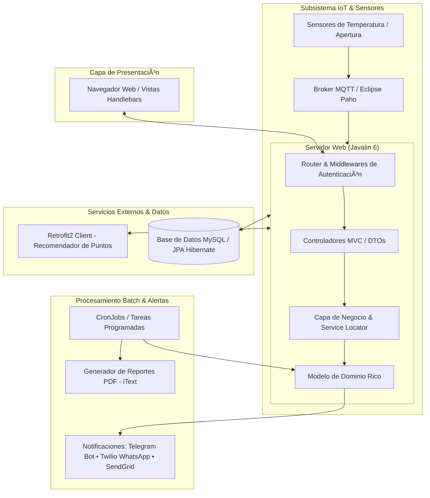

# 🥗 Sistema de Gestión de Acceso Alimentario y Red de Heladeras Comunitarias

<p align="center">
  
  
  
  
  
  
  
</p>

Sistema integral orientado a mitigar la inseguridad alimentaria en contextos de vulnerabilidad socioeconómica. Desarrollado como Trabajo Práctico Anual para la cátedra de **Diseño de Sistemas (2024) - UTN FRBA**. 

La plataforma articula y conecta a **donantes particulares, empresas, técnicos y personas en situación de vulnerabilidad**, proveyendo trazabilidad en tiempo real sobre una red distribuida de **heladeras comunitarias sensorizadas (IoT)**.

---

## 🏛️ Arquitectura del Sistema

La solución adopta una arquitectura **MVC con cliente liviano**, integrando procesamiento por lotes (Cronjobs), brokers de mensajería IoT y APIs externas de terceros:



---

## 🚀 Características Principales

### 🧊 Red de Heladeras Comunitarias e IoT
- **Telemetría y Sensores en Tiempo Real:** Recepción y procesamiento de eventos de temperatura y apertura de puertas mediante protocolo **MQTT**.
- **Gestión Automatizada de Incidentes:** Detección de anomalías térmicas y fallas de conexión; disparo automático de alertas a colaboradores suscritos y técnicos de la zona.
- **Recomendación Geográfica:** Integración con servicio REST externo (mediante **Retrofit2**) para sugerir puntos óptimos de colocación de heladeras según densidad demográfica y necesidad comunitaria.

### 🤝 Modelo de Colaboraciones y Fidelización
- **Diversidad de Formas de Donación:**
  - Donación de viandas (control de caducidad y trazabilidad).
  - Distribución / traslado de viandas entre heladeras con capacidad disponible.
  - Donaciones monetarias periódicas o únicas.
  - Gestión y mantenimiento de heladeras por parte de personas jurídicas.
- **Sistema de Puntos & Catálogo de Premios:** Reconocimiento y recompensas a colaboradores por sus aportes a la red.

### 💳 Acceso y Tarjetas para Personas Vulnerables
- Registro de titulares y menores a cargo.
- Asignación de tarjetas de apertura y control de cupos de retiro diario de viandas para evitar desabastecimiento.

### 📲 Notificaciones Multicanal
- Soporte multicanal desacoplado con patrón Adapter:
  - **Telegram:** Interacción bidireccional mediante `telegrambots`.
  - **WhatsApp / SMS:** Integración vía **Twilio SDK**.
  - **Email:** Alertas transaccionales con **SendGrid API**.

### ⏱️ Cronjobs y Reportes Periódicos
- Tareas programadas desacopladas (`cronjobs`) para:
  - Detección de fallas de conexión en sensores de heladeras.
  - Generación periódica de reportes exportables a **PDF** con **iText** (fallas históricas, movimientos de viandas, aportes por colaborador).
  - Mantenimiento y control de tarjetas.

---

## 🛠️ Stack Tecnológico

| Capa / Componente | Tecnología |
|---|---|
| **Lenguaje** | Java 17 |
| **Framework Web** | Javalin 6.3.0 |
| **Plantillas / Frontend** | Handlebars.java, HTML5, CSS3, JavaScript |
| **Persistencia / ORM** | Hibernate, JPA Extras, MySQL 8, HSQLDB (testing) |
| **IoT / Mensajería** | Eclipse Paho MQTT |
| **Clientes HTTP / APIs** | Retrofit 2 + Gson |
| **Notificaciones** | Twilio SDK, Telegram Bots, SendGrid Java |
| **Testing & Calidad** | JUnit 5, Mockito, JaCoCo, SpotBugs, Checkstyle |
| **Build & Empaquetado** | Apache Maven, Maven Shade Plugin (Multi-JAR) |

---

## ⚙️ Compilación y Ejecución

### Prerrequisitos
- **Java Development Kit (JDK) 17** o superior.
- **Apache Maven 3.8+**.
- Servidor **MySQL** en ejecución.

### Build del Proyecto
Para compilar y empaquetar la aplicación web y los cronjobs:
```bash
mvn clean package
```
Esto generará los artefactos JAR correspondientes en la carpeta `target/`:
- `app.jar`: Aplicación principal Javalin.
- `heladeras.jar`, `falla-conexion.jar`, `reportes.jar`, `tarjetas.jar`: Tareas batch / cronjobs.

### Ejecución de la Aplicación Web
```bash
java -jar target/app.jar
```
La aplicación web quedará accesible en `http://localhost:8080` (o el puerto configurado en el archivo de entorno).

---

## 👥 Equipo de Desarrollo

| Integrante | GitHub |
|---|---|
| **Uriel Grifman** | [@uriGrif](https://github.com/uriGrif) |
| **Thomas Ariel Luca** | [@thomyluca](https://github.com/thomyluca) |
| **Manuel Martinez** | [@ManuMar28](https://github.com/ManuMar28) |
| **Gonzalo Turri** | [@GonTurri](https://github.com/GonTurri) |
| **Tobias Winik** | [@twinik](https://github.com/twinik) |

---

## 📑 Enunciado
- [Trabajo Práctico Anual Integrador 2024 - DDS UTN FRBA](https://docs.google.com/document/d/13niiEppxrm8LjyrxmH5Pskrc7VVuPKWSFRi3WvhsXns/edit?tab=t.0)
